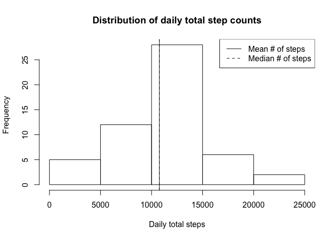
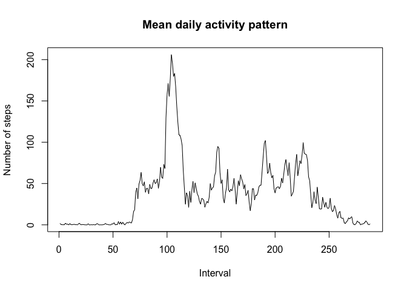
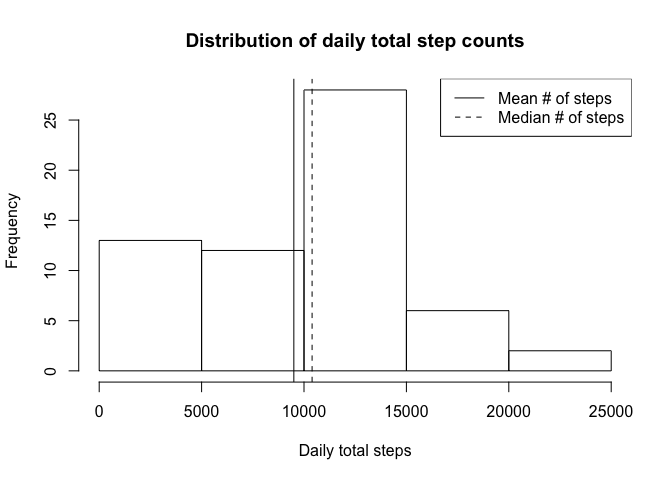
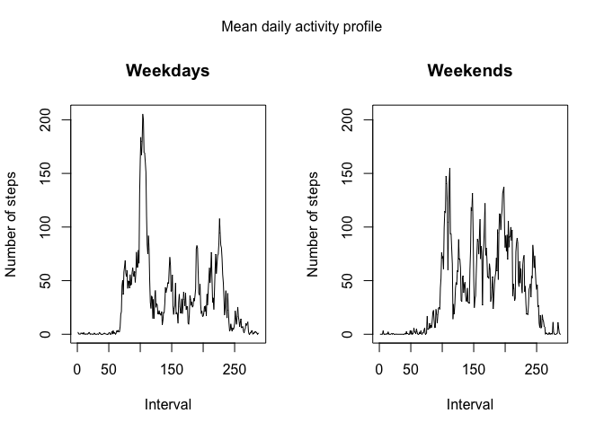

# Reproducible Research: Peer Assessment 1


## Loading and preprocessing the data

The activity data is loaded from a CSV file. Column 1, the step count, contains integers, column 2 is a date in YYYY-MM-DD format, and column 3 contains the interval identifier expressed as "military time", i.e., interval 1645 begins at 4.45 PM.


```r
activity <- read.csv("activity.csv", colClasses = c("integer", "Date", "integer"))
```

The end result is a data frame with the columns `steps`, `date`, and `interval`.

## What is mean total number of steps taken per day?


```r
dates <- unique(activity$date)
total.steps <- 0

for (i in seq_along(dates)) {
    # Grab the steps-per-interval data for this date
    steps <- subset(activity, date == dates[i], "steps")
    
    # If there is no step data at all from this date, set day's step count to NA
    # and advance to next iteration
    if (sum(!is.na(steps)) == 0) {
        total.steps[i] <- NA
        next
    }
    
    total.steps[i] <- sum(activity[activity$date == dates[i], "steps"], na.rm = TRUE)
}

mean.total.steps <- mean(total.steps, na.rm = TRUE)
median.total.steps <- median(total.steps, na.rm = TRUE)
```

The resulting mean total number of steps, rounded to nearest integer, is 1.0766189\times 10^{4}, and the median is 1.0765\times 10^{4}. There 8 days with no data available, and these days have been excluded from the determination of the mean.

Distribution of the total number of steps, again excluding the days with no data, is shown in the histogram produced by the following chunk. Mean and median are shown using solid and dashed vertical lines, respectively.


```r
hist(total.steps[!is.na(total.steps)], xlab = "Daily total steps", ylab = "Frequency",
     main = "Distribution of daily total step counts")
abline(v = mean.total.steps, lty = 1)
abline(v = median.total.steps, lty = 2)
legend("topright", c("Mean # of steps", "Median # of steps"), lty = c(1, 2))
```



## What is the average daily activity pattern?

The average daily activity pattern is determined by determining, for each interval, the mean number of steps taken during this interval over all days. `NA` values are simply ignored at this point.


```r
avg.steps <- 0
intervals <- unique(activity[, "interval"])

for (i in seq_along(intervals)) {
    avg.steps[i] <- mean(activity[activity[, "interval"] == intervals[i], "steps"],
                         na.rm = TRUE)
}

plot(seq_along(intervals), avg.steps, type = "l", xlab = "Interval", ylab = "Number of steps", main = "Mean daily activity pattern")
```



The interval with the highest average number of steps (206.1698113) is 835, i.e. the one which begins 8:35 AM.

## Inputing missing values

The data set includes 2304 rows with missing value, out of 17568 total rows. The missing values are now substituted by the median for that interval.


```r
activity.repna <- activity

for (i in seq_along(intervals)) {
    
    # Find the rows where the step count for this interval is NA
    na.pos <- is.na(activity[, "steps"]) & activity[, "interval"] == intervals[i]
    
    # Set the step count to the (NA-ignoring) median of that interval
    activity.repna[na.pos, "steps"] <- 
        median(activity.repna[activity.repna[, "interval"] == intervals[i], "steps"],
               na.rm = TRUE)
    
}

total.steps.repna <- 0

for (i in seq_along(dates)) {
    # Grab the steps-per-interval data for this date
    #steps <- subset(activity.repna, date == dates[i], "steps")
    
    total.steps.repna[i] <- sum(activity.repna[activity.repna$date == dates[i], "steps"])
}

mean.total.steps.repna <- mean(total.steps.repna)
median.total.steps.repna <- median(total.steps.repna)

hist(total.steps.repna, xlab = "Daily total steps", ylab = "Frequency",
     main = "Distribution of daily total step counts")
abline(v = mean.total.steps.repna, lty = 1)
abline(v = median.total.steps.repna, lty = 2)
legend("topright", c("Mean # of steps", "Median # of steps"), lty = c(1, 2))
```



Use of the augmented data set yields that the mean and median daily step counts are 9503.8688525 and 1.0395\times 10^{4}, respectively. The mean is appreciably lower than when NA values in the original data were ignored (instead of replaced). This might result if the steps are taken in bursts, with longer periods of no activity; then the median of any interval (within a period characterized by periodical activity) is likely zero, and the cumulative step count for estimated data ends up being lower than measured data.


## Are there differences in activity patterns between weekdays and weekends?

Weekday (Mon-Fri) and weekend routines may differ significantly from each other. In order to investigate this, separate mean daily activity profiles are derived from the data for weekdays and weekends.


```r
activity.daytype <- activity.repna

# Create a new factor column indicating whether date corresponds to
# weekday (days 1-5, Monday to Friday) or weekend
# (days 6 and 7, Saturday and Sunday).
#
# Using strftime looks more cumbersome than weekdays(), but the
# latter is locale dependent, while using day number is not.
activity.daytype$daytype <- as.factor(ifelse(
    as.numeric(strftime(activity.daytype$date, "%u")) <= 5,
    "weekday", "weekend"))

avg.steps.weekday <- 0
avg.steps.weekend <- 0

for (i in seq_along(intervals)) {
    avg.steps.weekday[i] <- mean(subset(activity.daytype, interval == intervals[i] & daytype == "weekday")$steps)
    avg.steps.weekend[i] <- mean(subset(activity.daytype, interval == intervals[i] & daytype == "weekend")$steps)
}

# Set up a 1x2 plot with space for an overall title
par(mfrow = c(1, 2), oma = c(0, 0, 2, 0))

# Daily mean activity, weekdays
plot(seq_along(intervals), avg.steps.weekday, type = "l",
     xlab = "Interval", ylab = "Number of steps", main = "Weekdays")

# Daily mean activity, weekends; scale the plot similarly to weekdays
plot(seq_along(intervals), avg.steps.weekday, type = "n",
     xlab = "Interval", ylab = "Number of steps", main = "Weekends")
# Add the actual data points
points(seq_along(intervals), avg.steps.weekend, type = "l")

# Add overall title
mtext("Mean daily activity profile", outer = TRUE)
```



Some difference between weekdays and weekends is apparent from the data: steps are distributed more equally, and the weekday peak centered at 835, is missing from the mean weekend step profile.
